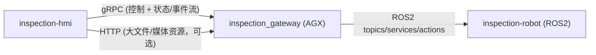

# inspection-hmi

大型工件视觉检测系统上位机（Qt 实现）。  
目标是发布一个可执行文件给 Windows 用户使用，不要求安装 ROS 环境。

当前仓库先以“接口与交互效果”为导向完善文档；`src/` 代码骨架尚未落地实现（后续按本文模块拆分建立）。

## 1. 目标与边界

目标：
- 导入 CAD 模型
- 在 CAD 表面点选检测点位（带法线），拍摄方向自动取 `-normal`
- 拍摄参数与规划参数使用系统默认值，不暴露给用户
- 调用网关服务触发路径规划与任务执行
- 实时展示导航与机械臂位姿（复合机械臂）状态：AGV 位姿/阶段、机械臂关节与末端位姿（可视化）、联锁条件与告警
- 执行过程中展示取图与检测结果：按点位查看抓拍图、缺陷框/置信度、历史记录与导出

不负责：
- 直接连接 ROS2 Topic/Service/Action
- 实现底盘/机械臂控制算法
- 实现 6D 位姿估计和联合优化算法
- 参与控制闭环的运动学/规划计算（但允许为“显示”做正解/坐标变换等可视化计算）

## 2. 通信架构



说明：
- 上位机只对接 `inspection_gateway`
- 所有机器人内部细节由网关屏蔽
- 字段与语义以 `inspection-api/proto/inspection_gateway.proto` 为准（UI 文档不再复制字段，避免漂移）

### 2.1 连接约定（建议）

HMI 需要提供一个“连接设置”：
- `gateway_host` / `gateway_port`（gRPC）
- `connect_timeout` / `rpc_timeout`
- 断线重连策略（指数退避）

运行方式：
- Windows 端只需要网络能访问 gateway，不需要安装 ROS2
- gateway 运行在机器人端（AGX/工控机），与 ROS2 在同一运行环境中

## 3. 运行模式

- `Engineer`（工程模式，PC）:
  - CAD 导入与编辑
  - 点位标注与角度调优
  - 路径预览与调试
  - 导航与机械臂位姿的联调监控（数字孪生视图）
- `Operator`（操作模式，小屏）:
  - 任务启动/暂停/停止
  - 状态监控与告警确认（导航 + 机械臂 + 联锁）
  - 取图/缺陷结果浏览（按点位、按时间轴）

## 4. 功能模块

- `CadSceneModule`:
  - 3D 模型加载、显示、拾取
- `TargetPointModule`:
  - CAD 表面点位标注（点 + 法线），拍摄方向默认 `-normal`，参数自动填充
- `PlanningClientModule`:
  - 调用 `SetInspectionTargets` + `PlanInspection` 并展示路径
- `ExecutionPanelModule`:
  - 任务控制（启动/暂停/继续/停止）与状态流展示
- `NavMonitorModule`:
  - 导航监控：当前位置/目标点/路径折线/到位与停止状态（以网关状态为准；路径折线来源 `InspectionPath.waypoints[].agv_pose`）
- `RobotStateModule`:
  - 复合机械臂状态卡：AGV + 机械臂基础状态、联锁条件提示、关键错误码
- `RobotTwinViewportModule`（推荐）:
  - 数字孪生可视化：把 `AgvStatus.current_pose` 与 `ArmStatus.current_joints` 映射为 2D/3D 位姿显示（用于监控与调试，不参与控制）
- `EventTimelineModule`:
  - 订阅 `SubscribeInspectionEvents` 并按时间轴展示 INFO/WARN/ERROR/CAPTURED/DEFECT_FOUND
- `CaptureResultModule`（依赖网关实现媒体访问：`DownloadMedia` 或 `url`）:
  - 取图结果查看：每个点位的抓拍图/缩略图、缺陷框叠加、导出
- `ResultViewerModule`:
  - 缺陷结果和历史记录查看

## 5. 技术选型建议

- UI 框架：`Qt 6 (Widgets 或 QML)`
- 构建系统：`CMake`
- 3D 显示：`VTK + QVTKOpenGLNativeWidget`
- 2D 导航视图：`QGraphicsView`（简单可控）或 `Qt Quick` 自绘（高刷新）
- CAD 导入：
  - V1：`STL/OBJ/PLY`
  - V2：`STEP/IGES`（OpenCASCADE）
- 网络通信：`gRPC`（控制 + 状态/事件流），媒体资源：`DownloadMedia`（优先）或 `HTTP url`（可选）
- 运动学可视化（可选）：基于 URDF 的正解（仅用于显示），例如 `pinocchio` / `orocos-kdl`

## 6. 跨平台构建

环境建议：
- Windows: `MSVC 2022 + Qt 6.5+ + CMake 3.22+`
- Linux (AGX): `GCC 11+ + Qt 6.5+ + CMake 3.22+`

示例构建命令（Linux）：

```bash
cmake -S . -B build -DCMAKE_BUILD_TYPE=Release
cmake --build build -j
```

## 7. 目录约定

```text
inspection-hmi/
├── src/       # 源码
├── assets/    # 图标、样式、模型示例
├── docs/      # 交互与原型文档
└── README.md
```

## 8. V1 里程碑

1. 基础框架与页面骨架（主窗口 + 三维视图 + 控制面板）
2. CAD 导入与点位标注交互（点 + 法线 + 拍摄角度）
3. 对接 `inspection_gateway` 的规划接口：路径预览（AGV 点位 + 机械臂关节目标 + 相机视锥/视线）
4. 对接状态与事件流：导航状态 + 机械臂状态 + 联锁/告警（Operator 也必须可用）
5. 取图/缺陷结果回显：按点位浏览事件与缺陷结果（缩略图 + 原图下载 + 缺陷框叠加）
6. 基础日志与结果导出（任务摘要 + 缺陷列表 + 关联点位）

## 9. 界面设计文档

- 详细 UI 设计见：`inspection-hmi/docs/hmi_ui_design.md`
