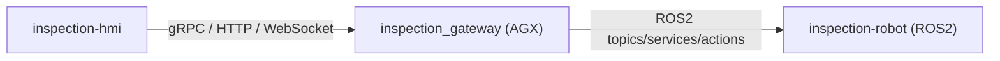

# inspection-hmi

大型工件视觉检测系统上位机（Qt 实现）。  
目标是发布一个可执行文件给 Windows 用户使用，不要求安装 ROS 环境。

## 1. 目标与边界

目标：
- 导入 CAD 模型
- 类似“地形刷”交互选择检测区域
- 配置拍照视野参数（工作距离、视场角、朝向约束）
- 调用网关服务触发路径规划与任务执行
- 实时展示机器人状态、进度和检测结果

不负责：
- 直接连接 ROS2 Topic/Service/Action
- 实现底盘/机械臂控制算法
- 实现 6D 位姿估计和联合优化算法

## 2. 通信架构



说明：
- 上位机只对接 `inspection_gateway`
- 所有机器人内部细节由网关屏蔽

## 3. 运行模式

- `Engineer`（工程模式，PC）:
  - CAD 导入与编辑
  - 区域刷选与参数调优
  - 路径预览与调试
- `Operator`（操作模式，小屏）:
  - 任务启动/暂停/停止
  - 状态监控与告警确认
  - 结果浏览

## 4. 功能模块

- `CadSceneModule`:
  - 3D 模型加载、显示、拾取
- `RegionBrushModule`:
  - 网格面片刷选、取消、分组
- `ViewParamModule`:
  - 设置工作距离、俯仰角限制、FOV
- `PlanningClientModule`:
  - 调用 `PlanInspection` 并展示路径
- `ExecutionPanelModule`:
  - 任务控制与状态流展示
- `ResultViewerModule`:
  - 缺陷结果和历史记录查看

## 5. 技术选型建议

- UI 框架：`Qt 6 (Widgets 或 QML)`
- 构建系统：`CMake`
- 3D 显示：`VTK + QVTKOpenGLNativeWidget`
- CAD 导入：
  - V1：`STL/OBJ/PLY`
  - V2：`STEP/IGES`（OpenCASCADE）
- 网络通信：`gRPC`（控制 + 状态流）

## 6. 跨平台构建

环境建议：
- Windows: `MSVC 2022 + Qt 6.5+ + CMake 3.22+`
- Linux (AGX): `GCC 11+ + Qt 6.5+ + CMake 3.22+`

示例构建命令（Linux）：

```bash
cmake -S . -B build -DCMAKE_BUILD_TYPE=Release
cmake --build build -j
```

## 7. 目录约定

```text
inspection-hmi/
├── src/       # 源码
├── assets/    # 图标、样式、模型示例
├── docs/      # 交互与原型文档
└── README.md
```

## 8. V1 里程碑

1. 基础框架与页面骨架（主窗口 + 三维视图 + 控制面板）
2. CAD 导入与刷选区域交互
3. 对接 `inspection_gateway` 的规划与状态接口
4. 任务控制闭环（开始/暂停/停止）
5. 结果回显与基础日志导出

## 9. 界面设计文档

- 详细 UI 设计见：`inspection-hmi/docs/hmi_ui_design.md`
