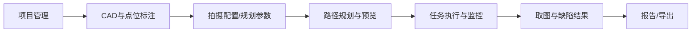
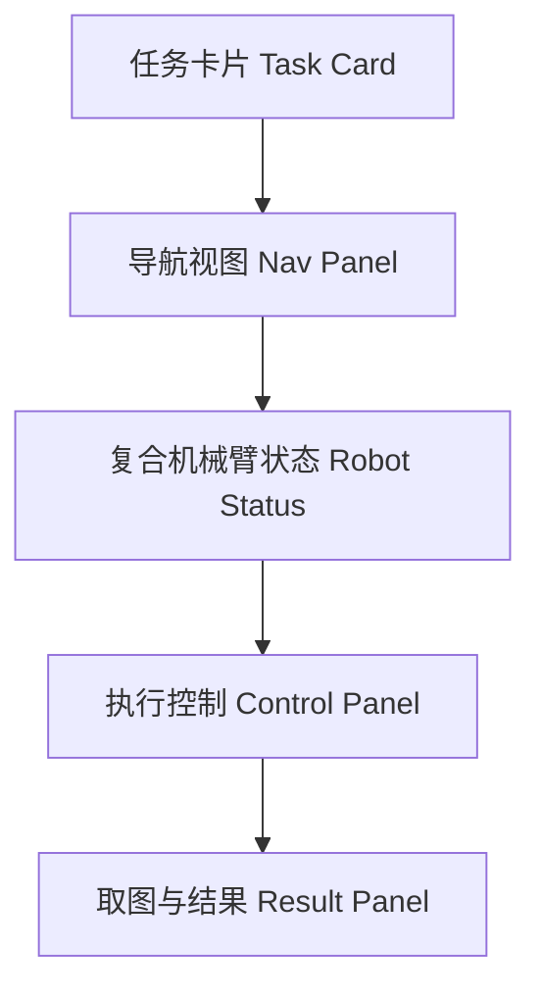
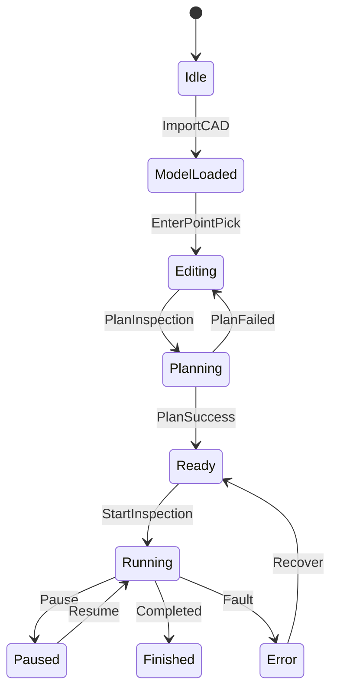

# HMI UI 设计（V1）

## 1. 设计目标

- 支持 CAD 导入与三维可视化
- 支持 CAD 表面点位标注（点 + 法线）与拍摄角度设置（默认沿法线方向）
- 支持固定对焦距离（工作距离，整条任务一个值）与角度约束（如最大倾角）
- 支持规划结果预览与任务执行控制
- 支持导航与机械臂位姿显示：复合机械臂状态监测（AGV 位姿/阶段 + 机械臂关节/末端位姿 + 联锁）
- 支持取图与缺陷结果回显：执行中与执行后均可按点位查看（缩略图/缺陷框/置信度/时间轴）
- 支持 PC 工程模式与 AGX 小屏操作模式

## 2. 信息架构

## 3. 工程模式（Engineer）布局

### 3.1 主界面结构

### 3.2 功能区定义

- `TopBar`
  - 新建项目/打开项目
  - 导入 CAD
  - 连接网关状态（在线/离线）
  - 模式切换（Engineer/Operator）
- `Project & Layers`
  - CAD 模型树
  - 点位列表（P1, P2...）与分组（可选）
  - 显示控制（显示/隐藏、透明度）
- `SceneViewport`（推荐把“CAD + 规划 + 机器人姿态”统一成一个场景视图）
  - 轨迹球旋转、缩放、平移
  - 面片拾取高亮
  - 点位标注可视化（点/法线箭头/相机视锥）
  - 规划路径叠加显示（AGV 点位 + 机械臂目标关节/姿态 + 相机视锥/视线）
  - 执行监控叠加显示（当前 AGV 位姿箭头、当前点位高亮、机械臂当前姿态骨架）
- `Edit / Plan / Monitor`
  - 点位标注：`添加点` / `删除点` / `法线翻转` / `点位列表编辑`
  - 拍摄角度：默认 `view_direction = -normal`，可调 `倾角(tilt)` 与 `绕光轴旋转(roll)`（用于控制成像方向）
  - 对焦距离：固定 `focus_distance_m`（工作距离，整条任务统一一个值）
  - Plan 参数：候选半径、yaw 步长、权重
  - Monitor：复合机械臂状态卡、联锁提示、事件列表、当前抓拍图预览（若可用）
  - 按钮：`生成路径` / `保存任务` / `下发执行`（或 `StartInspection`）
- `Status & Log`
  - 当前步骤、错误信息
  - 接口调用日志
  - 机器人状态卡（AGV / 机械臂 / 联锁）

## 4. 操作模式（Operator）布局

### 4.1 小屏界面结构

### 4.2 功能区定义

- `Task Card`
  - 当前任务名
  - 总点位数 / 当前点位
  - 剩余时间估计
- `Nav Panel`
  - 当前 AGV 位姿（`map` 坐标系）与朝向
  - 当前目标点/下一点位（来自规划路径 + 当前进度）
  - 路径折线（规划点位连线，必要时下采样；来源：`InspectionPath.waypoints[].agv_pose`）
  - 若启用地图底图：使用 `GetNavMap` 返回的 `resolution_m_per_pixel + origin` 把 `map(x,y)` 投影到像素坐标绘制
- `Robot Status`
  - AGV 状态：连接、运动/到位/停止、错误码、电量
  - 机械臂状态：连接、运动/到位、关节角、错误码、可操作度（若有）
  - 联锁提示：例如“等待 AGV 到位并停止”/“联锁满足，允许机械臂动作”
- `Control Panel`
  - `开始` `暂停` `继续` `停止`
  - 急停入口（仅显示，不替代硬件急停）
- `Result Panel`
  - 当前抓拍图（或最新抓拍缩略图）
  - 缺陷计数、缺陷类型、置信度、告警条目（可点入详情）
  - 事件时间轴（INFO/WARN/ERROR/CAPTURED/DEFECT_FOUND）

### 4.3 机器人信息展示规范（必须项）

约束：UI 字段命名与含义以 `inspection-api/proto/inspection_gateway.proto` 为准；若需新增字段，在 UI 文档中以“建议扩展”标注。

#### AGV 状态卡

- 连接状态：`AgvStatus.connected`
- 运动状态：`AgvStatus.moving / AgvStatus.arrived / AgvStatus.stopped`
- 当前位姿：`AgvStatus.current_pose`（`Pose2D{x,y,yaw,frame_id}`，通常 `frame_id="map"`）
- 当前速度：`AgvStatus.linear_velocity_mps / AgvStatus.angular_velocity_rps`
- 当前导航目标：`AgvStatus.goal_pose`（若正在导航）
- 地图：`AgvStatus.map_id`（可选，用于匹配导航底图）
- 定位质量：`AgvStatus.localization_quality`（可选）
- 电池：`AgvStatus.battery_percent`
- 错误码：`AgvStatus.error_code`

#### 机械臂状态卡

- 连接状态：`ArmStatus.connected`
- 运动状态：`ArmStatus.moving / ArmStatus.arrived`
- 使能状态：`ArmStatus.servo_enabled`（若网关提供）
- 当前关节角：`ArmStatus.current_joints`（按机械臂关节顺序；UI 侧可映射成 `J1~J6` 展示）
- 可操作度：`ArmStatus.manipulability`（若网关提供）
- 错误码：`ArmStatus.error_code`
- 末端位姿：`ArmStatus.tcp_pose`（建议 `frame_id="map"`，用于 HMI 叠加显示）
- 机械臂基座位姿：`ArmStatus.base_pose`（可选；用于可视化对齐与调试）

#### 协同联锁信息

- 当前任务阶段：`TaskStatus.phase`（`IDLE/LOCALIZING/PLANNING/EXECUTING/PAUSED/COMPLETED/...`）
- 任务进度：`TaskStatus.progress_percent`
- 当前动作：`TaskStatus.current_action`（建议规范化字符串，便于 UI 做高亮与筛选）
- 联锁条件提示：仅当 `TaskStatus.agv.arrived && TaskStatus.agv.stopped` 时，UI 标记“允许机械臂动作”
- 点位级信息：
  - 来自规划：`InspectionPath.total_points`、`InspectionPoint.point_id/group_id/agv_pose/arm_joint_goal`
  - 来自执行：`TaskStatus.current_waypoint_index / TaskStatus.current_point_id / TaskStatus.total_waypoints`
- 联锁状态（推荐直接展示）：`TaskStatus.interlock_ok / TaskStatus.interlock_message`
- 剩余时间估计：`TaskStatus.remaining_time_est_s`

#### 刷新策略

- 状态刷新：`SubscribeSystemState` 建议 `5~10 Hz`（UI 侧做节流与丢帧保护）
- 关键告警（错误、联锁失败）：事件驱动立即刷新

#### 颜色规范

- 正常：绿色
- 运动中：蓝色
- 等待联锁：橙色
- 错误：红色

### 4.4 取图与缺陷结果展示规范（必须项）

- 事件来源：`SubscribeInspectionEvents`（`InspectionEvent`）
- 基本展示字段：
  - 事件类型：`InspectionEvent.type`（`INFO/WARN/ERROR/CAPTURED/DEFECT_FOUND`）
  - 点位关联：`InspectionEvent.point_id`
  - 图像引用：`InspectionEvent.image`（`ImageRef{media, width, height, thumbnail_jpeg}`）
  - 缺陷结果：优先使用 `InspectionEvent.defects[]`（单个缺陷兼容字段：`InspectionEvent.defect`）
  - 时间戳：`InspectionEvent.timestamp`
- 图像获取策略：
  - 实时预览：优先用 `InspectionEvent.image.thumbnail_jpeg`
  - 查看原图：用 `DownloadMedia(media_id)` 下载 `InspectionEvent.image.media.media_id` 对应资源（或用 `url` 直连下载）
- 历史回看：
  - 用 `ListCaptures(task_id, point_id=0)` 获取任务内抓拍列表与缺陷结构化结果，再按需 `DownloadMedia`

## 5. 核心交互流程

### 5.1 点位标注到规划

1. 导入 CAD
2. 进入点位标注模式，在 CAD 表面点选检测点位（自动带出法线；默认 `view_direction = -normal`）
3. 设置拍摄配置：固定对焦距离 `focus_distance_m`（整条任务统一一个值）与角度约束（如最大倾角）
4. 如有需要，逐点调整拍摄角度（`view_direction` + `roll`）
5. 点击 `生成路径`
6. 展示路径预览与统计（点位数、里程、预计时长）
7. 确认后保存任务并执行

### 5.2 执行监控

1. 下发 `StartInspection`
2. 实时接收状态流
3. 在 `Nav Panel/SceneViewport` 中显示 AGV 当前位姿与目标点位；在 `Robot Status` 中显示机械臂关节与联锁
4. 当出现 `ERROR/WARN` 事件弹出可操作提示（并保留在事件列表中）
5. 当出现 `CAPTURED/DEFECT_FOUND` 事件更新结果面板（缩略图预览 + 原图下载 + 缺陷框叠加）
6. 完成后自动跳转结果页或保持在监控页并提示“完成”

## 6. 与网关接口映射

- `导入 CAD` -> `UploadCad`
- `提交点位与拍摄配置` -> `SetInspectionTargets`
- `生成路径` -> `PlanInspection`
- `断点恢复/重连加载规划` -> `GetPlan`
- `开始/暂停/继续/停止` -> `StartInspection/PauseInspection/ResumeInspection/StopInspection`
- `状态展示` -> `SubscribeSystemState`
- `事件/缺陷展示` -> `SubscribeInspectionEvents`
- `机器人信息卡/导航视图` -> `GetNavMap`（底图）+ `SubscribeSystemState`（`TaskStatus.agv/TaskStatus.arm`）+ `GetPlan/PlanInspection`（规划路径）
- `抓拍图访问` -> `SubscribeInspectionEvents`（拿到 `media_id/thumbnail`）+ `DownloadMedia`（拉取原图）或 `url` 直连下载
- `结果页列表` -> `ListCaptures`（按任务/点位拉取抓拍与缺陷结果）

## 7. 关键状态机（UI）

## 8. 组件建议（Qt）

- 主窗口：`QMainWindow`
- 左右面板：`QDockWidget`
- 参数表单：`QFormLayout + QDoubleSpinBox/QComboBox`
- 3D 视图：`QVTKOpenGLNativeWidget`
- 2D 导航视图：`QGraphicsView`（自绘 map/路径/位姿箭头）或 `Qt Quick Canvas`
- 状态日志：`QPlainTextEdit`
- 小屏模式：`QStackedWidget` 切换简化页面

## 9. V1 完成定义（DoD）

- 可导入 STL/OBJ 并显示
- 可完成点位标注并保存点位数据（点 + 法线 + 拍摄角度）
- 可设置拍摄配置并触发规划（固定对焦距离 + 角度约束）
- 可显示规划结果与任务执行状态（含 AGV 点位与机械臂目标信息）
- 可显示导航与机械臂状态（AGV 位姿 + 机械臂关节 + 联锁）并支持 Operator 小屏监控
- 可展示事件与缺陷结构化结果（缩略图预览 + 原图下载 + 缺陷框叠加）
- 可在 PC 与 AGX 小屏运行同一可执行程序（不同模式）
