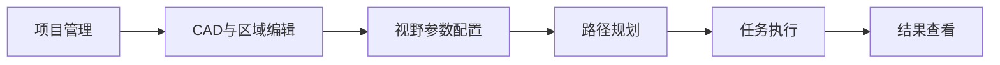
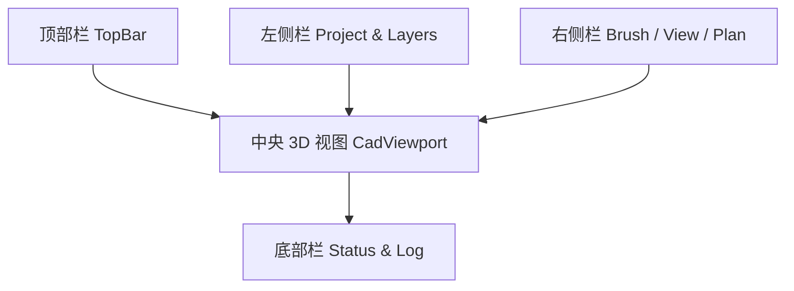
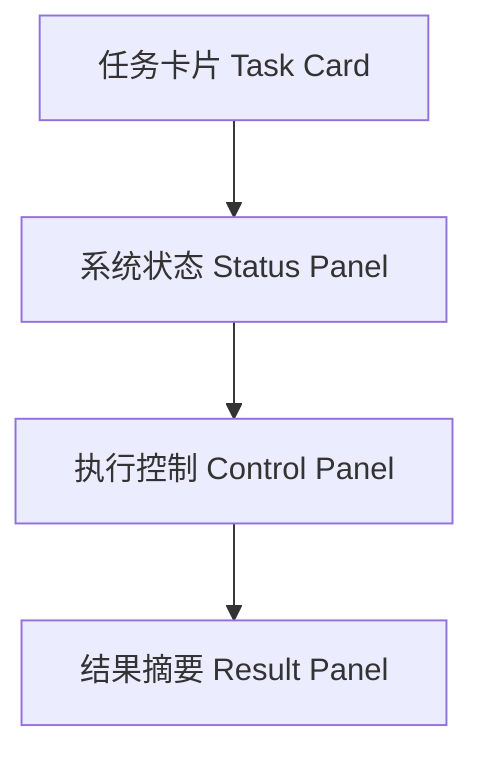
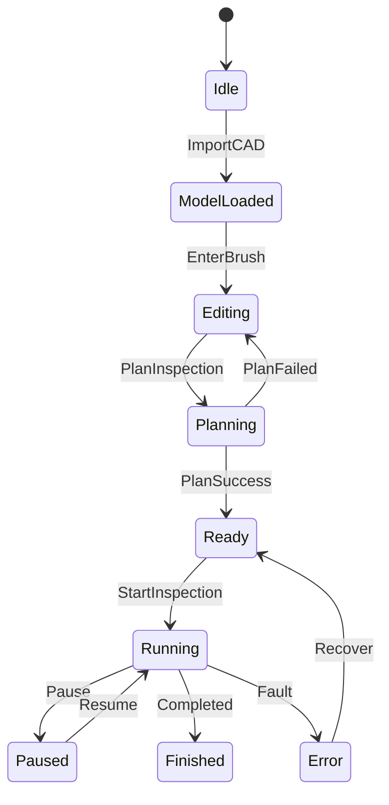

# HMI UI 设计（V1）

## 1. 设计目标

- 支持 CAD 导入与三维可视化
- 支持刷选检测区域与视野参数设置
- 支持规划结果预览与任务执行控制
- 支持 PC 工程模式与 AGX 小屏操作模式

## 2. 信息架构

## 3. 工程模式（Engineer）布局

### 3.1 主界面结构

### 3.2 功能区定义

- `TopBar`
  - 新建项目/打开项目
  - 导入 CAD
  - 连接网关状态（在线/离线）
  - 模式切换（Engineer/Operator）
- `Project & Layers`
  - CAD 模型树
  - 区域列表（Region_1, Region_2...）
  - 显示控制（显示/隐藏、透明度）
- `CadViewport`
  - 轨迹球旋转、缩放、平移
  - 面片拾取高亮
  - 区域刷选可视化
  - 规划路径叠加显示（AGV 点位 + 相机视锥）
- `Brush / View / Plan`
  - Brush 参数：半径、强度、增减模式
  - View 参数：工作距离、FOV、最大视角
  - Plan 参数：候选半径、yaw 步长、权重
  - 按钮：`生成路径` / `保存任务` / `下发执行`
- `Status & Log`
  - 当前步骤、错误信息
  - 接口调用日志
  - 机器人状态卡（AGV / 机械臂）

## 4. 操作模式（Operator）布局

### 4.1 小屏界面结构

### 4.2 功能区定义

- `Task Card`
  - 当前任务名
  - 总点位数 / 当前点位
  - 剩余时间估计
- `Status Panel`
  - AGV 状态：`arrived/stopped/error`
  - 机械臂状态：`moving/arrived/error`
  - 网关连接状态
- `Control Panel`
  - `开始` `暂停` `继续` `停止`
  - 急停入口（仅显示，不替代硬件急停）
- `Result Panel`
  - 当前拍照图缩略图
  - 缺陷计数、告警条目

### 4.3 机器人信息展示规范（必须项）

#### AGV 状态卡

- 连接状态：`connected` / `disconnected`
- 运动状态：`moving`, `arrived`, `stopped`
- 当前位姿：`x, y, yaw`（`map` 坐标系）
- 当前速度：`v, w`
- 电池：`battery_percent`
- 错误码：`error_code`

#### 机械臂状态卡

- 连接状态：`connected` / `disconnected`
- 运动状态：`moving`, `arrived`
- 使能状态：`servo_enabled`（若网关提供）
- 当前关节角：`joint1~joint6`
- 当前末端位姿：`tcp_pose`（可选）
- 可操作度：`manipulability`（可选）
- 错误码：`error_code`

#### 协同联锁信息

- 当前任务阶段：`LOCALIZING/PLANNING/EXECUTING/...`
- 当前点位：`current_waypoint / total_waypoints`
- 联锁条件提示：仅当 `agv.arrived && agv.stopped` 时允许机械臂动作
- 剩余时长估计：`remaining_time_est`

#### 刷新策略

- 状态刷新：`5~10 Hz`
- 关键告警（错误、联锁失败）：事件驱动立即刷新

#### 颜色规范

- 正常：绿色
- 运动中：蓝色
- 等待联锁：橙色
- 错误：红色

## 5. 核心交互流程

### 5.1 区域刷选到规划

1. 导入 CAD
2. 进入刷选模式，框选检测区域
3. 设置视野参数（工作距离/FOV/最大视角）
4. 点击 `生成路径`
5. 展示路径预览与统计（点位数、里程、预计时长）
6. 确认后保存任务并执行

### 5.2 执行监控

1. 下发 `StartInspection`
2. 实时接收状态流
3. 当出现 `ERROR/WARN` 弹出可操作提示
4. 完成后自动跳转结果页

## 6. 与网关接口映射

- `导入 CAD` -> `UploadCad`
- `提交区域与视野` -> `SetInspectionRegions`
- `生成路径` -> `PlanInspection`
- `开始/暂停/继续/停止` -> `StartInspection/PauseInspection/ResumeInspection/StopInspection`
- `状态展示` -> `SubscribeSystemState`
- `事件/缺陷展示` -> `SubscribeInspectionEvents`
- `机器人信息卡` -> `SubscribeSystemState`（读取 `AgvStatus/ArmStatus`）

## 7. 关键状态机（UI）

## 8. 组件建议（Qt）

- 主窗口：`QMainWindow`
- 左右面板：`QDockWidget`
- 参数表单：`QFormLayout + QDoubleSpinBox/QComboBox`
- 3D 视图：`QVTKOpenGLNativeWidget`
- 状态日志：`QPlainTextEdit`
- 小屏模式：`QStackedWidget` 切换简化页面

## 9. V1 完成定义（DoD）

- 可导入 STL/OBJ 并显示
- 可完成区域刷选并保存区域数据
- 可设置视野参数并触发规划
- 可显示规划结果与任务执行状态
- 可显示完整机器人状态信息（AGV + 机械臂 + 联锁）
- 可在 PC 与 AGX 小屏运行同一可执行程序（不同模式）
